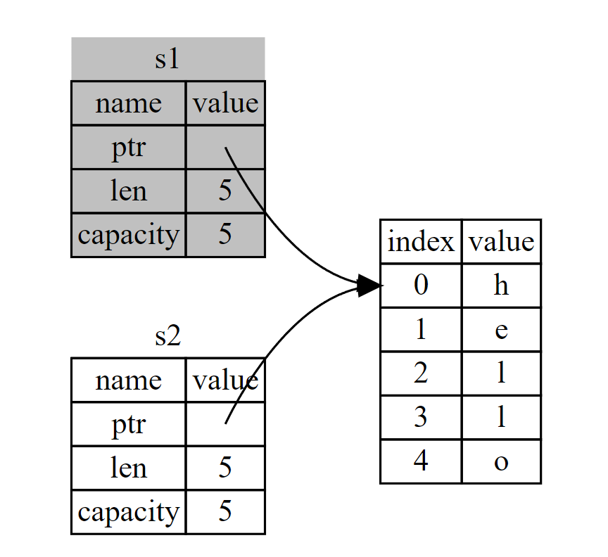
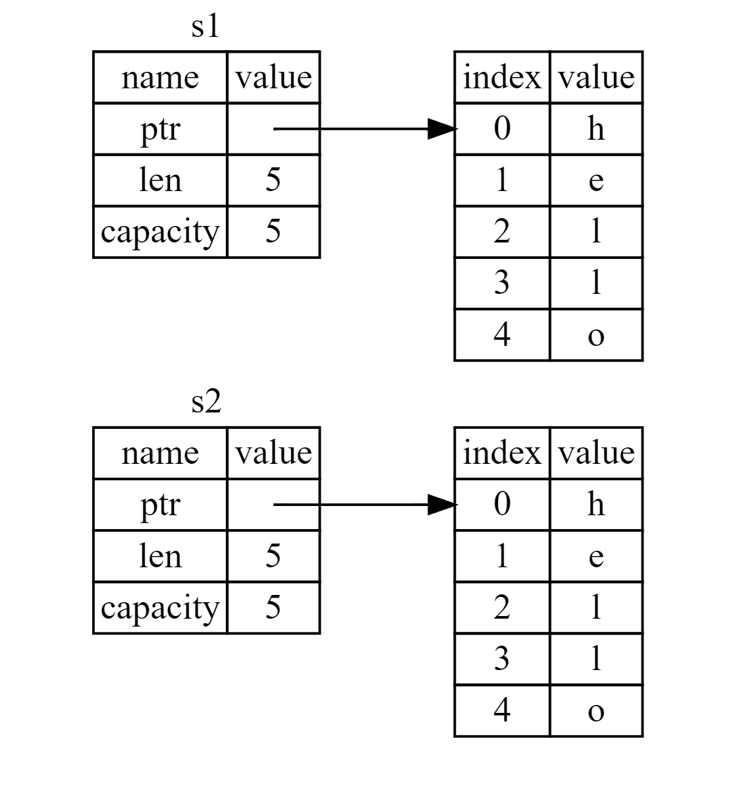

Ownership Rules

* Each value in Rust has an owner.
* There can only be one owner at a time.
* When the owner goes out of scope, the value will be dropped.


### Variable Scope

The variable is valid from the point at which it’s declared until the end of the current scope. 

```rust
// A variable and the scope in which it is valid

fn main() {
    {                      // s is not valid here, it’s not yet declared
        let s = "hello";   // s is valid from this point forward

        // do stuff with s
    }                      // this scope is now over, and s is no longer valid
}
```


### Variables and Data Interacting with Move

```rust
// Assigning the integer value of variable x to y

fn main() {
    let x = 5;
    let y = x;

    println!("x = {}, y = {}", x, y);  // 运行结果:x = 5, y = 5
}

// 1. bind the value 5 to x
// 2. make a copy of the value in x and bind it to y
// 3. result:two variables, x and y, and both equal 5
// 4. why:integers are simple values with a known, fixed size, and these two 5 values are pushed onto the stack.
```

```rust
fn main() {
    let s1 = String::from("hello");
    let s2 = s1;
    
    /*
    To ensure memory safety, after the line let s2 = s1;, Rust considers s1 as no longer valid. 
    Therefore, Rust doesn’t need to free anything when s1 goes out of scope.
     */
    println!("{}, world!", s1);
}

/*
运行结果(报错):
error[E0382]: borrow of moved value: `s1`
 --> c_basic\src\bin\test_.rs:5:28
  |
2 |     let s1 = String::from("hello");
  |         -- move occurs because `s1` has type `String`, which does not implement the `Copy` trait
3 |     let s2 = s1;
  |              -- value moved here
4 |
5 |     println!("{}, world!", s1);
  |                            ^^ value borrowed here after move
  |
*/
```

If you’ve heard the terms shallow copy and deep copy while working with other languages, the concept of copying the pointer, length, and capacity without copying the data probably sounds like making a shallow copy. But because Rust also invalidates the first variable, instead of being called a shallow copy, it’s known as a **move**. 



<center>Figure: Representation in memory after s1 has been invalidated</center>


### Variables and Data Interacting with Clone

If we do want to deeply copy the heap data of the String, not just the stack data, we can use a common method called **clone**.

```rust
// Here’s an example of the clone method in action:

fn main() {
    let s1 = String::from("hello");
    let s2 = s1.clone();

    println!("s1 = {}, s2 = {}", s1, s2);  // 运行结果:s1 = hello, s2 = hello
}
```

This works just fine and explicitly produces the behavior shown in Figure 1, where the heap data does get copied.



<center>Figure 1: Rust copied the heap data as well</center>


### Stack-Only Data: Copy

```rust
fn main() {
    let x = 5;
    let y = x;

    println!("x = {}, y = {}", x, y);  // 运行结果:x = 5, y = 5
}
```
But this code seems to contradict what we just learned: we don’t have a call to clone, but x is still valid and wasn’t moved into y.

The reason is that types such as integers that have a known size at compile time are stored entirely on the stack, so copies of the actual values are quick to make. That means there’s no reason we would want to prevent x from being valid after we create the variable y. In other words, there’s no difference between deep and shallow copying here, so calling clone wouldn’t do anything different from the usual shallow copying, and we can leave it out.

Rust has a special annotation called the Copy trait that we can place on types that are stored on the stack, as integers are. If a type implements the Copy trait, variables that use it do not move, but rather are trivially copied, making them still valid after assignment to another variable.

Rust won’t let us annotate a type with Copy if the type, or any of its parts, has implemented the Drop trait.

Here are some of the types that implement Copy:

* All the integer types, such as u32.
* The Boolean type, bool, with values true and false.
* All the floating-point types, such as f64.
* The character type, char.
* Tuples, if they only contain types that also implement Copy. For example, (i32, i32) implements Copy, but (i32, String) does not.


### Ownership and Functions

```rust
// The mechanics of passing a value to a function are similar to those when assigning a value to a variable. 

fn main() {
    let s = String::from("hello");  // s comes into scope

    takes_ownership(s);             // s's value moves into the function and so is no longer valid here

    let x = 5;                      // x comes into scope

    makes_copy(x);                  // x would move into the function, but i32 is Copy, so it's okay to still use x afterward

} // Here, x goes out of scope, then s. But because s's value was moved, nothing special happens.

fn takes_ownership(some_string: String) { // some_string comes into scope
    println!("{}", some_string);
} // Here, some_string goes out of scope and `drop` is called. The backing memory is freed.

fn makes_copy(some_integer: i32) { // some_integer comes into scope
    println!("{}", some_integer);
} // Here, some_integer goes out of scope. Nothing special happens.
```

### Return Values and Scope

```rust
// Returning values can also transfer ownership. 

fn main() {
    let s1 = gives_ownership();         // gives_ownership moves its return value into s1

    let s2 = String::from("hello");     // s2 comes into scope

    let s3 = takes_and_gives_back(s2);  // s2 is moved into takes_and_gives_back, which also moves its return value into s3
} // Here, s3 goes out of scope and is dropped. s2 was moved, so nothing happens. s1 goes out of scope and is dropped.

fn gives_ownership() -> String {             // gives_ownership will move its return value into the function that calls it

    let some_string = String::from("yours"); // some_string comes into scope

    some_string                              // some_string is returned and moves out to the calling function
}

// This function takes a String and returns one
fn takes_and_gives_back(a_string: String) -> String { // a_string comes into scope

    a_string  // a_string is returned and moves out to the calling function
}
```