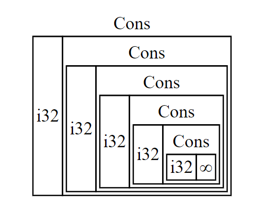
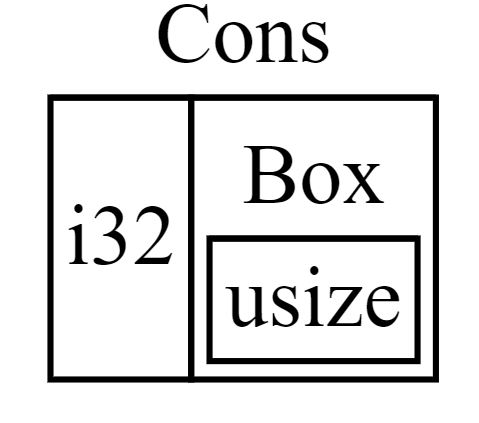

## Enabling Recursive Types with Boxes

A value of recursive type can have another value of the same type as part of itself.
Recursive types pose an issue because at compile time Rust needs to know how much space a type takes up.
However, the nesting of values of recursive types could theoretically continue infinitely, so Rust can’t know how much space the value needs.
Because boxes have a known size, we can enable recursive types by inserting a box in the recursive type definition.

```rust
enum List {
    Cons(i32, List),
    Nil,
}

use crate::List::{Cons, Nil};


fn main() {
    let _list = Cons(1, Cons(2, Cons(3, Nil)));
}

/*
程序运行结果(报错):
error[E0072]: recursive type `List` has infinite size
 --> d_advanced\src\bin\box1_.rs:4:1
  |
4 | enum List {
  | ^^^^^^^^^
5 |     Cons(i32, List),
  |               ---- recursive without indirection
  |
help: insert some indirection (e.g., a `Box`, `Rc`, or `&`) to break the cycle
  |
5 |     Cons(i32, Box<List>),
  |               ++++    +
 */
```


The compiler starts by looking at the Cons variant, which holds a value of type i32 and a value of type List. Therefore, Cons needs an amount of space equal to the size of an i32 plus the size of a List. To figure out how much memory the List type needs, the compiler looks at the variants, starting with the Cons variant. The Cons variant holds a value of type i32 and a value of type List, and this process continues infinitely, as shown in Figure 1.



<center>Figure 1: An infinite List consisting of infinite Cons variants</center>


```rust
enum List {
    Cons(i32, Box<ListBox>),
    Nil,
}

use crate::List::{Cons, Nil};

fn main() {
    let _list_box = Cons(1, Box::new(Cons(2, Box::new(Nil))));
}
```

The Cons variant needs the size of an i32 plus the space to store the box’s pointer data. The Nil variant stores no values, so it needs less space than the Cons variant. We now know that any List value will take up the size of an i32 plus the size of a box’s pointer data. By using a box, we’ve broken the infinite, recursive chain, so the compiler can figure out the size it needs to store a List value. Figure 2 shows what the Cons variant looks like now.



<center>Figure 2: A List that is not infinitely sized because Cons holds a Box</center>