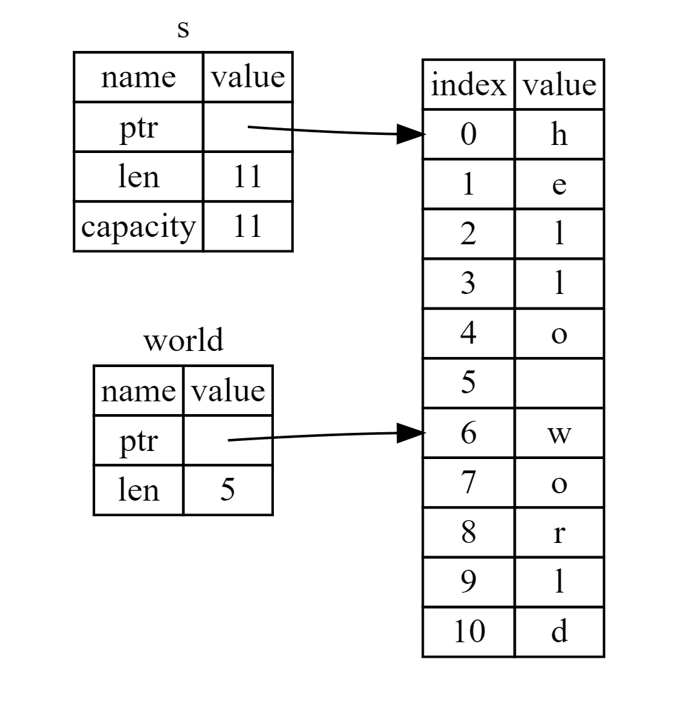

A dynamically-sized view into a contiguous sequence, [T]. Contiguous here means that elements are laid out so that every element is the same distance from its neighbors.

Slices are a view into a block of memory represented as a pointer and a length.

Slices are either mutable or shared. The shared slice type is &[T], while the mutable slice type is &mut [T], where T represents the element type. 

### String Slices

The str type, also called a ‘string slice’, is the most primitive string type. It is usually seen in its borrowed form, &str. It is also the type of string literals, &'static str.

A &str is made up of two components: a pointer to some bytes, and a length.

A string slice is a reference to part of a String, and it looks like this:

```rust
fn main() {
    let s: String = String::from("hello world");

    let hello: &str = &s[0..5];
    let world: &str = &s[6..11];
}
```

Rather than a reference to the entire String, hello is a reference to a portion of the String, specified in the extra [0..5] bit. We create slices using a range within brackets by specifying [starting_index..ending_index], where starting_index is the first position in the slice and ending_index is one more than the last position in the slice. Internally, the slice data structure stores the starting position and the length of the slice, which corresponds to ending_index minus starting_index. So, in the case of let world = &s[6..11];, world would be a slice that contains a pointer to the byte at index 6 of s with a length value of 5.



<center>Figure: String slice referring to part of a String</center>