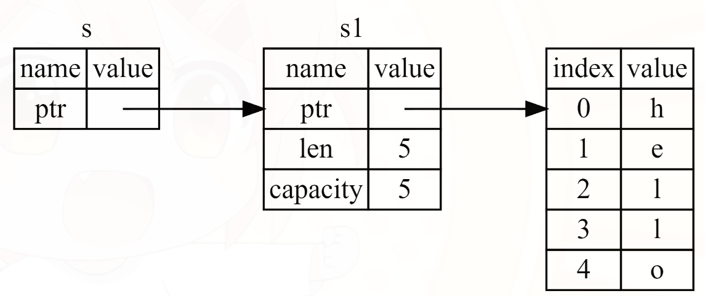

```rust
fn calculate_length(s: String) -> (String, usize) {
    let length = s.len(); // len() returns the length of a String
    (s, length)
}

fn main() {
    let s1 = String::from("hello");

    let (s2, len) = calculate_length(s1);

    println!("The length of '{}' is {}.", s2, len);  // print->The length of 'hello' is 5.
}
```

Here is how you would define and use a calculate_length function that has a reference to an object as a parameter instead of taking ownership of the value:

```rust
// 与上等价且代码更加简洁

fn main() {
    let s1 = String::from("hello");

    // The &s1 syntax lets us create a reference that refers to the value of s1 but does not own it. Because it does not own it, the value it points to will not be dropped when the reference stops being used.
    let len = calculate_length(&s1);

    println!("The length of '{}' is {}.", s1, len); // print->The length of 'hello' is 5.
}

// the signature of the function uses & to indicate that the type of the parameter s is a reference.
fn calculate_length(s: &String) -> usize { // s is a reference to a String
    s.len()
} // Here, s goes out of scope. But because it does not have ownership of what it refers to, it is not dropped.
```

First, notice that all the tuple code in the variable declaration and the function return value is gone. Second, note
that we pass **&s1** into calculate_length and, in its definition, we take **&String** rather than String. These ampersands represent **references**, and they allow you to refer to some value without taking ownership of it. Figure 1 depicts this concept.



<center>Figure 1: A diagram of &String s pointing at String s1</center>

The scope in which the variable s is valid is the same as any function parameter’s scope, but the value pointed to by
the reference is not dropped when s stops being used, because s doesn’t have ownership. When functions have references
as parameters instead of the actual values, we won’t need to return the values in order to give back ownership, because
we never had ownership.

We call the action of creating a reference borrowing. As in real life, if a person owns something, you can borrow it
from them. When you’re done, you have to give it back. You don’t own it.

```rust
fn main() {
    let s = String::from("hello");

    // Attempting to modify a borrowed value
    change(&s); // 默认为不可变引用
}

fn change(some_string: &String) {
    // error[E0596]: cannot borrow `*some_string` as mutable, as it is behind a `&` reference
    some_string.push_str(", world");
}
```

Just as variables are immutable by default, so are references. We’re not allowed to modify something we have a reference
to.


### Mutable References

```rust
fn main() {
    let mut s = String::from("hello");

    change(&mut s);
}

fn change(some_string: &mut String) {
    some_string.push_str(", world");
}
```

Mutable references have one big restriction: if you have a mutable reference to a value, you can have no other
references to that value. This code that attempts to create two mutable references to s will fail:

```rust
fn main() {
    let mut s = String::from("hello");

    let r1 = &mut s;
    // error[E0499]: cannot borrow `s` as mutable more than once at a time
    let r2 = &mut s;

    println!("{}, {}", r1, r2);
}
```

can use curly brackets to create a new scope, allowing for multiple mutable references, just not simultaneous ones:

```rust
fn main() {
    let mut s = String::from("hello");

    {
        let r1 = &mut s;
    } // r1 goes out of scope here, so we can make a new reference with no problems.

    let r2 = &mut s;
}
```

We also cannot have a mutable reference while we have an immutable one to the same value.

```rust
fn main() {
    let mut s = String::from("hello");

    let r1 = &s; // no problem
    let r2 = &s; // no problem
    // error[E0502]: cannot borrow `s` as mutable because it is also borrowed as immutable
    let r3 = &mut s;

    println!("{}, {}, and {}", r1, r2, r3);
}
```

Note that a reference’s scope starts from where it is introduced and continues through the last time that reference is
used. For instance, this code will compile because the last usage of the immutable references, the println!, occurs
before the mutable reference is introduced:

```rust
fn main() {
    let mut s = String::from("hello");

    let r1 = &s; // no problem
    let r2 = &s; // no problem
    println!("{} and {}", r1, r2); // variables r1 and r2 will not be used after this point

    let r3 = &mut s; // no problem
    println!("{}", r3);
}
```

The scopes of the immutable references r1 and r2 end after the println! where they are last used, which is before the
mutable reference r3 is created. These scopes don’t overlap, so this code is allowed: the compiler can tell that the
reference is no longer being used at a point before the end of the scope.


### Dangling References

In languages with pointers, it’s easy to erroneously create a dangling pointer—a pointer that references a location in memory that may have been given to someone else—by freeing some memory while preserving a pointer to that memory. In Rust, by contrast, the compiler guarantees that references will never be dangling references: if you have a reference to some data, the compiler will ensure that the data will not go out of scope before the reference to the data does.

```rust
fn main() {
    let reference_to_nothing = dangle();
}

// error[E0106]: missing lifetime specifier
fn dangle() -> &String { // dangle returns a reference to a String

    let s = String::from("hello"); // s is a new String

    &s // we return a reference to the String, s
} // Here, s goes out of scope, and is dropped. Its memory goes away. Danger!
```

Because s is created inside dangle, when the code of dangle is finished, s will be deallocated. But we tried to return a reference to it. That means this reference would be pointing to an invalid String. 

The solution here is to return the String directly:

```rust
fn main() {
    let reference_to_nothing = no_dangle();
}

fn no_dangle() -> String {
    let s = String::from("hello");

    s
}
```

This works without any problems. Ownership is moved out, and nothing is deallocated.


### The Rules of References

* At any given time, you can have either one mutable reference or any number of immutable references.
* References must always be valid.