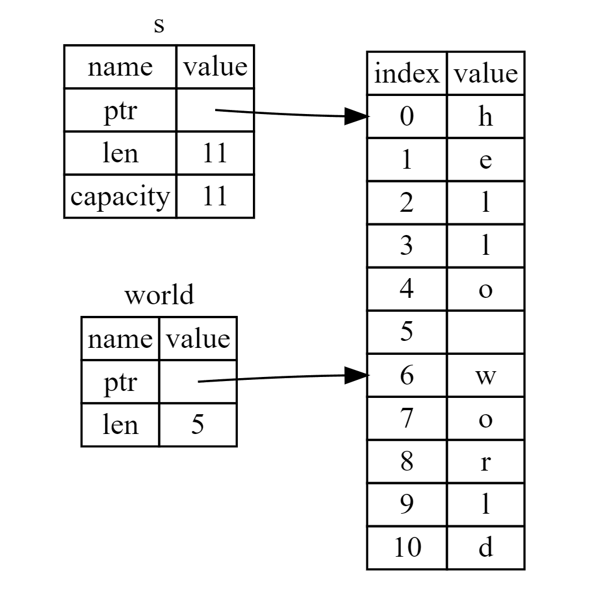

A slice is a [dynamically sized type](https://doc.rust-lang.org/reference/dynamically-sized-types.html) representing a 'view' into a sequence of elements of type T. The slice type is written as [T].

Slice types are generally used through pointer types. For example:

* &[T]: a 'shared slice', often just called a 'slice'. It doesn't own the data it points to; it borrows it.
* &mut [T]: a 'mutable slice'. It mutably borrows the data it points to.
* Box<[T]>: a 'boxed slice'

### String Slices

A string slice is a reference to part of a String, and it looks like this:

```rust
fn main() {
    let s: String = String::from("hello world");

    let hello: &str = &s[0..5];
    let world: &str = &s[6..11];
}
```

Rather than a reference to the entire String, hello is a reference to a portion of the String, specified in the extra [0..5] bit. We create slices using a range within brackets by specifying [starting_index..ending_index], where starting_index is the first position in the slice and ending_index is one more than the last position in the slice. Internally, the slice data structure stores the starting position and the length of the slice, which corresponds to ending_index minus starting_index. So, in the case of let world = &s[6..11];, world would be a slice that contains a pointer to the byte at index 6 of s with a length value of 5.



<center>Figure: String slice referring to part of a String</center>