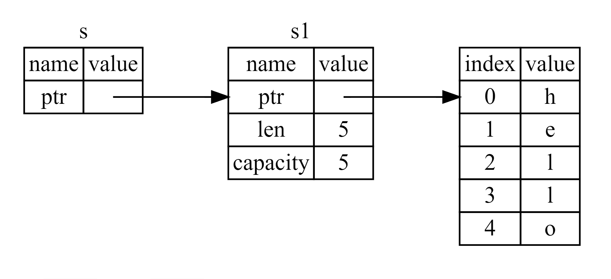

```rust
fn main() {
    let s1 = String::from("hello");

    let (s2, len) = calculate_length(s1);

    println!("The length of '{}' is {}.", s2, len);
}

fn calculate_length(s: String) -> (String, usize) {
    let length = s.len(); // len() returns the length of a String

    (s, length)
}


// 代码更加简洁
// Here is how you would define and use a calculate_length function that has a reference to an object as a parameter instead of taking ownership of the value:
fn main() {
    let s1 = String::from("hello");
    
    // The &s1 syntax lets us create a reference that refers to the value of s1 but does not own it. Because it does not own it, the value it points to will not be dropped when the reference stops being used.
    let len = calculate_length(&s1);

    println!("The length of '{}' is {}.", s1, len);
}

// the signature of the function uses & to indicate that the type of the parameter s is a reference.
fn calculate_length(s: &String) -> usize { // s is a reference to a String
    s.len()
} // Here, s goes out of scope. But because it does not have ownership of what
  // it refers to, it is not dropped.
```
First, notice that all the tuple code in the variable declaration and the function return value is gone. Second, note that we pass **&s1** into calculate_length and, in its definition, we take **&String** rather than String. These ampersands represent **references**, and they allow you to refer to some value without taking ownership of it. Figure 1 depicts this concept.



<center>Figure 1: A diagram of &String s pointing at String s1</center>

The scope in which the variable s is valid is the same as any function parameter’s scope, but the value pointed to by the reference is not dropped when s stops being used, because s doesn’t have ownership. When functions have references as parameters instead of the actual values, we won’t need to return the values in order to give back ownership, because we never had ownership.

We call the action of creating a reference borrowing. As in real life, if a person owns something, you can borrow it from them. When you’re done, you have to give it back. You don’t own it.

```rust
// Attempting to modify a borrowed value
fn main() {
    let s = String::from("hello");

    change(&s); // 默认为不可变引用
}

fn change(some_string: &String) {
    some_string.push_str(", world");
}

/*
程序运行结果:
error[E0596]: cannot borrow `*some_string` as mutable, as it is behind a `&` reference
 --> c_basic\src\bin\test_.rs:8:5
  |
7 | fn change(some_string: &String) {
  |                        ------- help: consider changing this to be a mutable reference: `&mut String`
8 |     some_string.push_str(", world");
  |     ^^^^^^^^^^^^^^^^^^^^^^^^^^^^^^^ `some_string` is a `&` reference, so the data it refers to cannot be borrowed as mutable
*/
```

Just as variables are immutable by default, so are references. We’re not allowed to modify something we have a reference to.

#### Mutable References

```rust
fn main() {
    let mut s = String::from("hello");

    change(&mut s);
}

fn change(some_string: &mut String) {
    some_string.push_str(", world");
}
```

Mutable references have one big restriction: if you have a mutable reference to a value, you can have no other references to that value. This code that attempts to create two mutable references to s will fail:

```rust
fn main() {
    let mut s = String::from("hello");

    let r1 = &mut s;
    let r2 = &mut s;

    println!("{}, {}", r1, r2);
}

/*
程序运行结果:
error[E0499]: cannot borrow `s` as mutable more than once at a time
 --> c_basic\src\bin\test_.rs:5:14
  |
4 |     let r1 = &mut s;
  |              ------ first mutable borrow occurs here
5 |     let r2 = &mut s;
  |              ^^^^^^ second mutable borrow occurs here
6 |
7 |     println!("{}, {}", r1, r2);
  |                        -- first borrow later used here
*/
```

The restriction preventing multiple mutable references to the same data at the same time allows for mutation but in a very controlled fashion. It’s something that new Rustaceans struggle with because most languages let you mutate whenever you’d like. The benefit of having this restriction is that Rust can prevent data races at compile time. A data race is similar to a race condition and happens when these three behaviors occur:

* Two or more pointers access the same data at the same time.
* At least one of the pointers is being used to write to the data.
* There’s no mechanism being used to synchronize access to the data.


can use curly brackets to create a new scope, allowing for multiple mutable references, just not simultaneous ones:

```rust
fn main() {
    let mut s = String::from("hello");

    {
        let r1 = &mut s;
    } // r1 goes out of scope here, so we can make a new reference with no problems.

    let r2 = &mut s;
}
```

Rust enforces a similar rule for combining mutable and immutable references. This code results in an error:

```rust
fn main() {
    let mut s = String::from("hello");

    let r1 = &s; // no problem
    let r2 = &s; // no problem
    let r3 = &mut s; // BIG PROBLEM

    println!("{}, {}, and {}", r1, r2, r3);
}

/*
程序运行结果:
error[E0502]: cannot borrow `s` as mutable because it is also borrowed as immutable
 --> c_basic\src\bin\test_.rs:6:14
  |
4 |     let r1 = &s; // no problem
  |              -- immutable borrow occurs here
5 |     let r2 = &s; // no problem
6 |     let r3 = &mut s; // BIG PROBLEM
  |              ^^^^^^ mutable borrow occurs here
7 |
8 |     println!("{}, {}, and {}", r1, r2, r3);
  |                                -- immutable borrow later used here
*/
```

We also cannot have a mutable reference while we have an immutable one to the same value.

Users of an immutable reference don’t expect the value to suddenly change out from under them! However, multiple immutable references are allowed because no one who is just reading the data has the ability to affect anyone else’s reading of the data.

Note that a reference’s scope starts from where it is introduced and continues through the last time that reference is used. For instance, this code will compile because the last usage of the immutable references, the println!, occurs before the mutable reference is introduced:

```rust
fn main() {
    let mut s = String::from("hello");

    let r1 = &s; // no problem
    let r2 = &s; // no problem
    println!("{} and {}", r1, r2);
    // variables r1 and r2 will not be used after this point

    let r3 = &mut s; // no problem
    println!("{}", r3);
}
```

The scopes of the immutable references r1 and r2 end after the println! where they are last used, which is before the mutable reference r3 is created. These scopes don’t overlap, so this code is allowed: the compiler can tell that the reference is no longer being used at a point before the end of the scope.


#### Dangling References

悬垂引用(Dangling References)也叫做悬垂指针,意思为指针指向某个值后,这个值被释放掉了,而指针仍然存在,其指向的内存可能不存在任何值或已被其它变量重新使用.在Rust中编译器可以确保引用永远也不会变成悬垂状态:当你获取数据的引用后,编译器可以确保数据不会在引用结束前被释放,要想释放数据,必须先停止其引用的使用.

```rust
fn main() {
    let reference_to_nothing = dangle();
}

fn dangle() -> &String { // dangle returns a reference to a String

    let s = String::from("hello"); // s is a new String

    &s // we return a reference to the String, s
} // Here, s goes out of scope, and is dropped. Its memory goes away.
  // Danger!

/*
程序运行结果:
error[E0106]: missing lifetime specifier
 --> c_basic\src\bin\test_.rs:5:16
  |
5 | fn dangle() -> &String {
  |                ^ expected named lifetime parameter
  |
  = help: this function's return type contains a borrowed value, but there is no value for it to be borrowed from
help: consider using the `'static` lifetime
  |
5 | fn dangle() -> &'static String {
  |                 +++++++

why:Because s is created inside dangle, when the code of dangle is finished, s will be deallocated. But we tried to return a reference to it. That means this reference would be pointing to an invalid String. That’s no good! Rust won’t let us do this.

The solution here is to return the String directly:

fn no_dangle() -> String {
    let s = String::from("hello");

    s
}
*/
```
