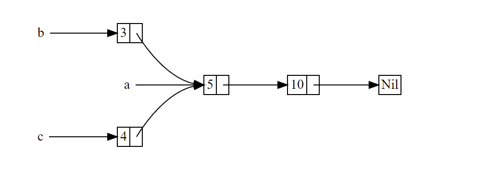

In the majority of cases, ownership is clear: you know exactly which variable owns a given value. However, there are cases when a single value might have multiple owners. For example, in graph data structures, multiple edges might point to the same node, and that node is conceptually owned by all of the edges that point to it. A node shouldn’t be cleaned up unless it doesn’t have any edges pointing to it and so has no owners.

You have to enable multiple ownership explicitly by using the Rust type Rc<T>, which is an abbreviation for reference counting. The Rc<T> type keeps track of the number of references to a value to determine whether or not the value is still in use. If there are zero references to a value, the value can be cleaned up without any references becoming invalid.

Note that Rc<T> is only for use in single-threaded scenarios.



<center>Figure 1: Two lists, b and c, sharing ownership of a third list, a</center>

We’ll create list a that contains 5 and then 10. Then we’ll make two more lists: b that starts with 3 and c that starts with 4. Both b and c lists will then continue on to the first a list containing 5 and 10. In other words, both lists will share the first list containing 5 and 10.

Trying to implement this scenario using our definition of List with Box<T> won’t work, as shown in Listing 1:

```rust
// Listing 1: Demonstrating we’re not allowed to have two lists using Box<T> that try to share ownership of a third list

enum List {
    Cons(i32, Box<List>),
    Nil,
}

use crate::List::{Cons, Nil};

fn main() {
    let a = Cons(5, Box::new(Cons(10, Box::new(Nil))));
    let b = Cons(3, Box::new(a));
    let c = Cons(4, Box::new(a));
}

/*
程序运行结果(报错):
error[E0382]: use of moved value: `a`
  --> d_advanced\src\bin\smart_pointer_r_rec0_.rs:30:30
   |
28 |     let a = Cons(5, Box::new(Cons(10, Box::new(Nil))));
   |         - move occurs because `a` has type `List`, which does not implement the `Copy` trait
29 |     let b = Cons(3, Box::new(a));
   |                              - value moved here
30 |     let c = Cons(4, Box::new(a));
   |                              ^ value used here after move
 */
```

The Cons variants own the data they hold, so when we create the b list, a is moved into b and b owns a. Then, when we try to use a again when creating c, we’re not allowed to because a has been moved.

We could change the definition of Cons to hold references instead, but then we would have to specify lifetime parameters. By specifying lifetime parameters, we would be specifying that every element in the list will live at least as long as the entire list.

Instead, we’ll change our definition of List to use Rc<T> in place of Box<T>, as shown in Listing 2. Each Cons variant will now hold a value and an Rc<T> pointing to a List. When we create b, instead of taking ownership of a, we’ll clone the Rc<List> that a is holding, thereby increasing the number of references from one to two and letting a and b share ownership of the data in that Rc<List>. We’ll also clone a when creating c, increasing the number of references from two to three. Every time we call Rc::clone, the reference count to the data within the Rc<List> will increase, and the data won’t be cleaned up unless there are zero references to it.

```rust
// Listing 2: A definition of List that uses Rc<T>

enum List {
    Cons(i32, Rc<List>),
    Nil,
}

use crate::List::{Cons, Nil};
use std::rc::Rc;

fn main() {
    let a = Rc::new(Cons(5, Rc::new(Cons(10, Rc::new(Nil)))));
    let b = Cons(3, Rc::clone(&a));
    let c = Cons(4, Rc::clone(&a));
}
```

Via **immutable references** , Rc<T> allows you to share data between multiple parts of your program for reading only. 