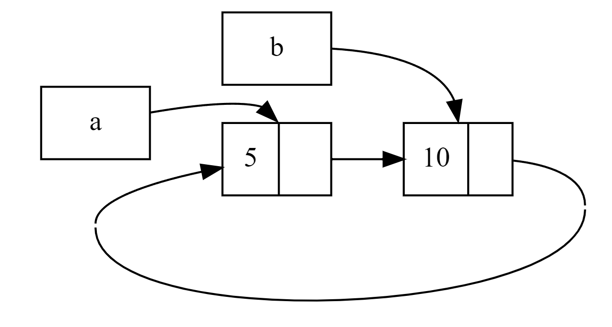

```rust
use crate::List::{Cons, Nil};
use std::cell::RefCell;
use std::rc::Rc;

#[derive(Debug)]
enum List {
    Cons(i32, RefCell<Rc<List>>),
    Nil,
}

impl List {
    fn tail(&self) -> Option<&RefCell<Rc<List>>> {
        match self {
            Cons(_, item) => Some(item),
            Nil => None,
        }
    }
}


fn main() {
    let a = Rc::new(Cons(5, RefCell::new(Rc::new(Nil))));
    println!("a initial rc count = {}", Rc::strong_count(&a)); // a initial rc count = 1
    println!("a next item = {:?}", a.tail()); // a next item = Some(RefCell { value: Nil })

    let b = Rc::new(Cons(10, RefCell::new(Rc::clone(&a))));
    println!("a rc count after b creation = {}", Rc::strong_count(&a)); // a rc count after b creation = 2
    println!("b initial rc count = {}", Rc::strong_count(&b)); // b initial rc count = 1
    println!("b next item = {:?}", b.tail()); // b next item = Some(RefCell { value: Cons(5, RefCell { value: Nil }) })

    if let Some(link) = a.tail() {
        *link.borrow_mut() = Rc::clone(&b);
    }

    println!("b rc count after changing a = {}", Rc::strong_count(&b)); // b rc count after changing a = 2
    println!("a rc count after changing a = {}", Rc::strong_count(&a)); // a rc count after changing a = 2


    // Uncomment the next line to see that we have a cycle;
    // it will overflow the stack
    // println!("a next item = {:?}", a.tail());
}
```

We create an Rc<List> instance holding a List value in the variable a with an initial list of 5, Nil. We then create an Rc<List> instance holding another List value in the variable b that contains the value 10 and points to the list in a.

We modify a so it points to b instead of Nil, creating a cycle. We do that by using the tail method to get a reference to the RefCell<Rc<List>> in a, which we put in the variable link. Then we use the borrow_mut method on the RefCell<Rc<List>> to change the value inside from an Rc<List> that holds a Nil value to the Rc<List> in b.

The reference count of the Rc<List> instances in both a and b are 2 after we change the list in a to point to b. At the end of main, Rust drops the variable b, which decreases the reference count of the b Rc<List> instance from 2 to 1. The memory that Rc<List> has on the heap won’t be dropped at this point, because its reference count is 1, not 0. Then Rust drops a, which decreases the reference count of the a Rc<List> instance from 2 to 1 as well. This instance’s memory can’t be dropped either, because the other Rc<List> instance still refers to it. The memory allocated to the list will remain uncollected forever. To visualize this reference cycle, we’ve created a diagram in Figure 1.



<center>Figure 1: A reference cycle of lists a and b pointing to each other</center>